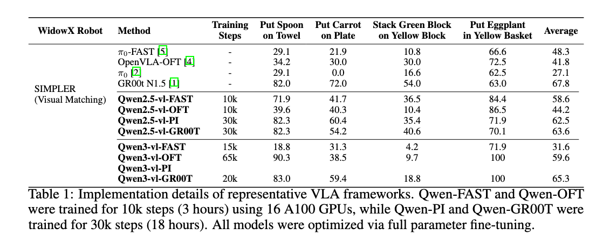
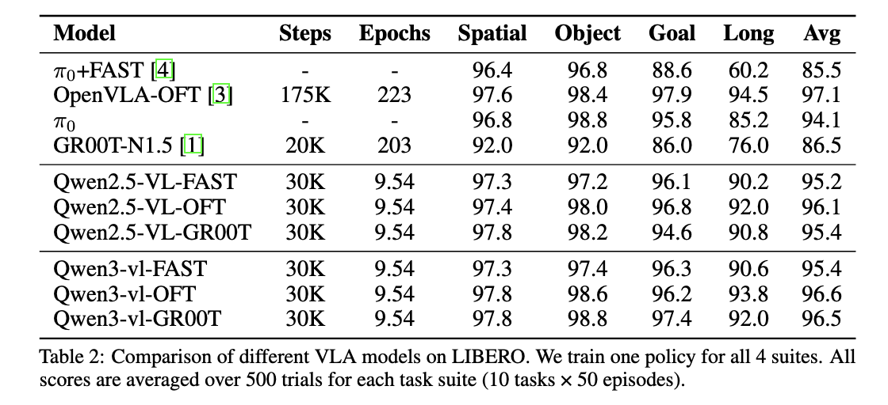

# StarVLA: A Lego-like Codebase for Vision-Language-Action Model Developing

<!-- [](https://github.com/starVLA/starVLA) -->
[](https://huggingface.co/StarVLA) [](assets/starVLA_wechat.jpg)

**[2025/12/15]** Completed a release regression check to ensure the public code runs smoothly. Routine updates—including recent support for the LeRobot dataset v3.0 and DeepSpeed ZeRO-3—will continue to appear in the [🚧 Daily Development Log](https://github.com/starVLA/starVLA/issues/64#issue-3727060165).

**[2025/12/09]** Be the first open-source repository that can train with [train your vlm](starVLA/training/train_starvlm.py), [train your vla](starVLA/training/train_starvla.py), and [train your vla with vlm](starVLA/training/train_starvla_cotrain.py). Check out how to co-train your VLA with multimodal data in [examples/CoTrainVLM](examples/CoTrainVLM/README.md).

**[2025/11/12]** We now support [Florence-2](https://github.com/anyantudre/Florence-2-Vision-Language-Model) as a smaller VLM for resource-constrained development. StarVLA can now run on a single A100 GPU. See the [🚀Train with a smaller VLM](#train-smaller-vlm) section for more details. 


**[2025/10/30]:** We released the LIBERO Training & Evaluation README. Results are very promising. More detail are in [examples/LIBERO](examples/LIBERO). 

**[2025/10/25]:** We fixed several script links and so everything is smoother now. Thanks to the community for the feedback.


---

StarVLA is a modular and flexible codebase for developing Vision-Language Model (VLM) to Vision-Language-Action (VLA) models.
In StarVLA (also a pun on “start VLA” ),  each functional component (model, data, trainer, config, evaluation, etc.) follows a top-down, intuitive separation and high cohesion and low coupling principle, which enabling plug-and-play design, rapid prototyping, and independent debugging.


*Modules with solid borders are supported; borderless ones are coming soon.


## 🔥 Key Features


<details open>
<summary><b>Various VLA Frameworks </b></summary>

- [x] **Qwen-FAST**: Utilizes Qwen2.5-VL-3B with a fast tokenizer to autoregressively generate discrete action tokens conditioned on visual and linguistic inputs (in line with π₀-fast).
- [x] **Qwen-OFT**: Combines Qwen2.5-VL-3B with an MLP action head to perform parallel decoding of continuous actions, regressed from the hidden states of predefined special action tokens (in line with OpenVLA-OFT/EO).
- [x] **Qwen-PI**: Integrates the Flow-Matching (FM) action expert with Qwen2.5-VL-3B, adopting a diffusion-based approach for continuous action prediction (in line with π₀).
- [x] **Qwen-GR00T**: Implements a dual-system VLA architecture, where Qwen2.5-VL-3B serves as System2 for high-level vision-language reasoning, while the Flow-Matching module acts as System1 for rapid action prediction (in line with GR00T).


<p align="center">
  
</p>

<p align="center">
  
</p>


For dynamic updates, see our [🍀 Overleaf](https://www.overleaf.com/read/qqtwrnprctkf#d5bdce), which continuously presents our real-time experimental results.


### 📈 Model Zoo
We release a series of modified models and finetuning checkpoints to facilitate reproduction and downstream use.

#### ✅ Available Modified Models

| Model | Description  | Link |
|-------|-------------|------|
| **Qwen2.5-VL-3B-Action** | Extend Qwen2.5-VL's vocabulary with Fast Tokens  | [🤗 Hugging Face](https://huggingface.co/StarVLA/Qwen2.5-VL-3B-Instruct-Action) |
| **Qwen3-VL-4B-Action** | Extend Qwen3-VL's vocabulary with Fast Tokens | [🤗 Hugging Face](https://huggingface.co/StarVLA/Qwen3-VL-4B-Instruct-Action) |

#### ✅ Available Finetuning Checkpoints
| Model | Description | WidowX | Link |
|-------|-------------|------|------|
| **QWen2.5-FAST-Bridge-RT-1** | Training on [Bridge](https://huggingface.co/datasets/IPEC-COMMUNITY/bridge_orig_lerobot) and [Fractal](https://huggingface.co/datasets/IPEC-COMMUNITY/fractal20220817_data_lerobot) | 58.6 | [🤗 Hugging Face](https://huggingface.co/StarVLA/Qwen-FAST-Bridge-RT-1) |
| **QWen2.5-OFT-Bridge-RT-1** | Training on [Bridge](https://huggingface.co/datasets/IPEC-COMMUNITY/bridge_orig_lerobot) and [Fractal](https://huggingface.co/datasets/IPEC-COMMUNITY/fractal20220817_data_lerobot) | 41.8 | [🤗 Hugging Face](https://huggingface.co/StarVLA/Qwen-OFT-Bridge-RT-1) |
| **QWen2.5-PI-Bridge-RT-1** | Training on [Bridge](https://huggingface.co/datasets/IPEC-COMMUNITY/bridge_orig_lerobot) and [Fractal](https://huggingface.co/datasets/IPEC-COMMUNITY/fractal20220817_data_lerobot)  | 62.5 | [🤗 Hugging Face](https://huggingface.co/StarVLA/Qwen-FM-Bridge-RT-1) |
| **QWen2.5-GR00T-Bridge-RT-1** | Training on [Bridge](https://huggingface.co/datasets/IPEC-COMMUNITY/bridge_orig_lerobot) and [Fractal](https://huggingface.co/datasets/IPEC-COMMUNITY/fractal20220817_data_lerobot) | 63.6 | [🤗 Hugging Face](https://huggingface.co/StarVLA/Qwen-PI-Bridge-RT-1) |
| **QWen-GR00T-Bridge** | Training only on [Bridge](https://huggingface.co/datasets/IPEC-COMMUNITY/bridge_orig_lerobot) | 71.4 | [🤗 Hugging Face](https://huggingface.co/StarVLA/Qwen-GR00T-Bridge) |
| **QWen3VL-OFT-Bridge-RT-1** | Training on [Bridge](https://huggingface.co/datasets/IPEC-COMMUNITY/bridge_orig_lerobot) and [Fractal](https://huggingface.co/datasets/IPEC-COMMUNITY/fractal20220817_data_lerobot) | 42.7 | [🤗 Hugging Face](https://huggingface.co/StarVLA/Qwen3VL-OFT-Bridge-RT-1) |
| **QWen3VL-GR00T-Bridge-RT-1** | Training on [Bridge](https://huggingface.co/datasets/IPEC-COMMUNITY/bridge_orig_lerobot) and [Fractal](https://huggingface.co/datasets/IPEC-COMMUNITY/fractal20220817_data_lerobot) | 65.3 | [🤗 Hugging Face](https://huggingface.co/StarVLA/Qwen3VL-GR00T-Bridge-RT-1) |

---
</details>

<details close>
<summary><b>Various Simulation Benchmarks </b></summary>


- [x] **SimplerEnV**
- [x] **LIBERO**
- [ ] **Robocasa**
- [ ] **RLBench**
- [ ] **RoboTwin**
- [ ] **BEHAVIOR**

</details>


<details close>
<summary><b> Various Training Strategies </b></summary>

* [x] Single Imitation Learning
* [x] Multimodal Multitasks Co-training
* [ ] Reinforcement Learning Adaption

</details>

---

## 🌟 How does starVLA make model development Lego-like again?
👇 StarVLA achieves “Lego-like” development via the following designs:
<a id="model"></a>
<details close>
<summary><b>1. Smoke test any submodule </b></summary>

StarVLA emphasizes a modular model design. Each major framework file can be run standalone for rapid debugging and smoke test your code. For example:

```bash
# model
python starVLA/model/framework/QwenOFT.py --config_yaml starvla_cotrain_oxe.yaml
# dataloader
python starVLA/dataloader/lerobot_datasets.py --config_yaml starvla_cotrain_oxe.yaml

```
Note: `starVLA/model/framework/yourframework.py` is the single external API surface of the model; it should mirror (be structurally isomorphic to) the framework diagram in your paper.
</details>
<a id="data"></a>
<details close>
<summary><b>2. Explicit model boundaries</b></summary>

StarVLA follows top‑down decomposition and the principle of high cohesion & low coupling.

For example:
- Dataloader
  - Returns a raw, model‑agnostic dict only; no model‑specific preprocessing (e.g., tokenizer, image encoding).
  - A single sample should include (add/remove as needed):
    - image: list[PIL.Image] | np.ndarray
    - lang: str
    - action: np.ndarray[T, action_dim]
    - state: Optional[np.ndarray[..., state_dim]]

Both `framework.forward()` and `framework.predict_action()` operate directly on raw inputs, keeping train/test boundaries explicit and easy to hack.
</details>
<a id="config"></a>
<details close>
<summary><b>3. Flexible configuration system</b></summary>

StarVLA uses a single global configuration object
Parameters are passed primarily via extensible dicts, allowing overrides and controlled redundancy.

</details>


🧪 *To self‑test and iterate on StarVLA’s usability, we re‑implemented several representative VLA frameworks. Our have done a beta test: an internal developer can stand up a new VLA framework in under half a day (leat then 3 hours), and an new user can build their first custom VLA framework within a single day. More design insights for each item can be found in [assets/intro_v1.md](assets/intro_v1.md).*


---

## 🚀 Quick Start

<details close>
<summary><b>🛠 Environment Setup
</b></summary>


```bash
# Clone the repo
git clone https://github.com/starVLA/starVLA

# Create conda environment
conda create -n starVLA python=3.10 -y
conda activate starVLA

# Install requirements
pip install -r requirements.txt

# Install FlashAttention2
pip install flash-attn --no-build-isolation

# Install starVLA
pip install -e .
```


⚠️ **Common Issues**
flash-attn can be tricky to install because it must match your system’s CUDA toolkit (nvcc) and PyTorch versions. The `--no-build-isolation` flag resolves most issues, but on newer systems you may need to manually choose a compatible flash-attn version. Ensure your CUDA driver/toolkit and torch versions are aligned. Check your environment:

```bash
nvcc -V
pip list | grep -E 'torch|transformers|flash-attn'
```

If issues persist, pick a flash-attn release that matches your versions (CUDA and torch) or ask chatGPT with searching function for help with the outputs above.

We have verified that `flash-attn==2.7.4.post1` works well with nvcc versions `12.0` and `12.4`.

</details>

<details close>
<summary><b>👀 Quick Check StarVLA
</b></summary>


```bash
# check framework with fake examples
python starVLA/model/framework/QwenGR00T.py
```


You should download [Qwen3-VL-4B-Instruct](https://huggingface.co/Qwen/Qwen3-VL-4B-Instruct) and put it as `./playground/Pretrained_models/Qwen3-VL-4B-Instruct`. It should build successfully and `print(model)`. You can also call `model.forward(fake_data)` and obtain unnormalized actions via `model.predict_action(fake_data)`.

</details>

<details close>
<summary><b>🧪 Evaluate Existing Models</b></summary>

We publish benchmark-specific evaluation guides inside each folder under [examples](examples).

**Recommended quick start: LIBERO simulator**

1. Download [Qwen2.5-VL-GR00T-LIBERO-4in1](https://huggingface.co/StarVLA/Qwen2.5-VL-GR00T-LIBERO-4in1).
2. Follow the [LIBERO Eval](https://github.com/starVLA/starVLA/tree/starVLA/examples/LIBERO#-1-environment-setup) instructions to prepare the Python environment.
3. Set the environment variables at the top of [`eval_libero.sh`](examples/LIBERO/eval_files/eval_libero.sh) and [`run_policy_server.sh`](examples/LIBERO/eval_files/run_policy_server.sh).
4. Run:

```bash
bash examples/LIBERO/eval_files/run_policy_server.sh &
bash examples/LIBERO/eval_files/eval_libero.sh
```

⚠️ **Common issue**  
If `NotImplementedError: Framework QwenGR00T is not implemented` appears, run `python starVLA/model/framework/QwenGR00T.py` to verify your environment.

</details>

<details open>
<summary><b>🚀 Train Your Own Model</b></summary>

We ship benchmark-specific training scripts under [examples](examples). We recommend starting with the  [LIBERO suite](examples/LIBERO/train_files):

1. Edit `run_libero_train.sh` to point to your checkpoint, dataset root, and desired output directory.
2. Launch training:

```bash
bash examples/LIBERO/train_files/run_libero_train.sh
```

⚠️ **Note:** Ensure all absolute paths inside `run_libero_train.sh` match your local environment before launching.

</details>


## 📖 FAQ

<details close>
<summary><b>Q: Why not put preprocessing in the dataloader?</b></summary>

A: We profiled it: data preprocessing takes <1% time. Keeping it inside the Framework is acceptable and allows model‑specific flexible handling.

</details>

<details close>
<summary><b>Q: Can I use a backbone other than Qwen2.5-VL?</b></summary>

A: Yes. Implement new vision + language modules and compose them inside a Framework; any other existing models can be swapped in. Yet, due to the framework processing raw action data, it is very easy to swap in.
</details>

<details close> <summary><b>Q: Why isn't there an abstract interface for the vision tower?</b></summary>
  
A: We believe that VLM will become the base model and will inherently possess its own native vision tower.

</details>


<details close>
<summary><b>Q: Can I override or add parameters via the terminal?</b></summary>

A: Yes. We use OmegaConf.load(args.config_yaml) as the single configuration entry; standalone debugging also uses args.config_yaml. Parameters may be intentionally redundant; you can freely add or override them via the CLI.

Examples:
```bash
accelerate launch \
  --config_file starVLA/config/deepseeds/deepspeed_zero2.yaml  \
  --num_processes 8 \
  starVLA/training/train_internvla.py \
  --config_yaml ./starVLA/config/training/starvla_cotrain_oxe.yaml \
  --framework.qwenvl.base_vlm Qwen/Qwen2.5-VL-7B-Instruct \ # override framework choice
  --framework.qwenvl.base_vlm Qwen/Qwen2.5-VL-7B-Instruct \ # override framework choice
  --framework.action_model.new_module ${module_name} \ # plug-in a new module to action model
```

⚠️: `framework.action_model.new_module` only adds to the global config; its behavior is on your framework.


</details>

<details close>
<summary><b>Q: Can I freeze the VLM via parameters?</b></summary>

A: Yes. StarVLA uses a regex / name list to control freezing. Example:
```
--trainer.freeze_modules "qwen_vl_interface.model.model.visual,dino_encoder" \
```
Tips: You can ``print(your_model)`` first to check the relative paths of your modules and list them as comma-separated values.
(implementation in `TrainerUtils.freeze_backbones`.)

</details>

<details close>
<summary><b>Q: Can I set different learning rates for different modules?</b></summary>

A: Yes, starVLA also uses name: value dict to control learning group. Config example:
```yaml
trainer:
  learning_rate:
    base: 1e-05      # other modules
    qwen_vl_interface: 1.0e-05
    action_model: 1.0e-04
```
(Also referenced in `trainer_tools.build_param_lr_groups`.)
</details>

<details close>
<summary><b>Q: Can I resume training from a checkpoint?</b></summary>

A: Yes, somehow can. Specify the latest checkpoint path in `config.yaml`, e.g.:
```yaml
trainer:
  pretrained_checkpoint: path_to_steps_10000.pt
  reload_modules: "action_model"
```
Empty `reload_modules` means full load all model. However, starVLA does not save  `optimizer state`. It requires a lot of  memory/disk and bring limited benefit.
</details>


<details id="train-smaller-vlm" close>
<summary><b>🚀 Train with a smaller VLM</b></summary>

```bash
    accelerate launch \
      --config_file starVLA/config/deepseeds/deepspeed_zero2.yaml \
      --main_process_ip $MASTER_ADDR \
      --main_process_port $MASTER_PORT \
      --machine_rank $SLURM_PROCID \
      --num_machines $SLURM_NNODES \
      --num_processes=${TOTAL_GPUS} \
      starVLA/training/train_starvla.py \
      --config_yaml ./starVLA/config/training/starvla_cotrain_oxe.yaml \
      --framework.framework_py QwenGR00T \
      --framework.qwenvl.base_vlm microsoft/Florence-2-large \
      --run_root_dir ${run_root_dir} \
      --run_id ${run_id} \
      --wandb_project your_project \
      --wandb_entity your_name
```

Note: To ensure better compatibility with already released checkpoints, we are continuing to use `--framework.qwenvl`. This parameter will be unified in the next release.

</details>


## ✍️ Citation & Copyright


StarVLA is released under the MIT License, which permits commercial use, modification, distribution, and private use. Rebases are allowed for forks and feature branches; when rebasing from upstream StarVLA, use descriptive commit messages (e.g., "chore: rebase from StarVLA") and keep at least the two latest upstream commits as separate. See [License](LICENSE) for details.


```
@misc{starvla2025,
  title  = {StarVLA: A Lego-like Codebase for Vision-Language-Action Model Developing},
  author = {starVLA Community},
  url = {https://github.com/starVLA/starVLA}
  year   = {2025}
}
```


## 🤝 Contributing


1) If you find an issue, please open an Issue first. If it persists or needs clarification, start a Discussion and we’ll follow up.

2) If you have ideas to improve StarVLA, feel free to open a PR. To make sure we will accept your effect, please align scope and design first via an Issue or by booking a short sync with this [Cooperation Form](https://forms.gle/R4VvgiVveULibTCCA).

3) If you’re blocked or want to brainstorm, please fill out the [Cooperation Form](https://forms.gle/R4VvgiVveULibTCCA). We host office hours every Friday afternoon for live discussion.

Tip: Before submitting a PR, run make check locally to pass formatting and lint.


##  🙏 Acknowledgements
This project draws inspiration and references from several notable open-source initiatives, including:  
- [LeRobot](https://github.com/huggingface/lerobot)  
- [GR00T](https://github.com/NVIDIA/Isaac-GR00T/tree/main)  
- [DeepSpeed](https://github.com/deepspeedai/DeepSpeed)  
- [Qwen-VL](https://github.com/QwenLM/Qwen3-VL/tree/main)  
- [InternVL](https://github.com/OpenGVLab/InternVL)  

The codebase was originally forked from [InternVLA-M1](https://github.com/InternRobotics/InternVLA-M1).

