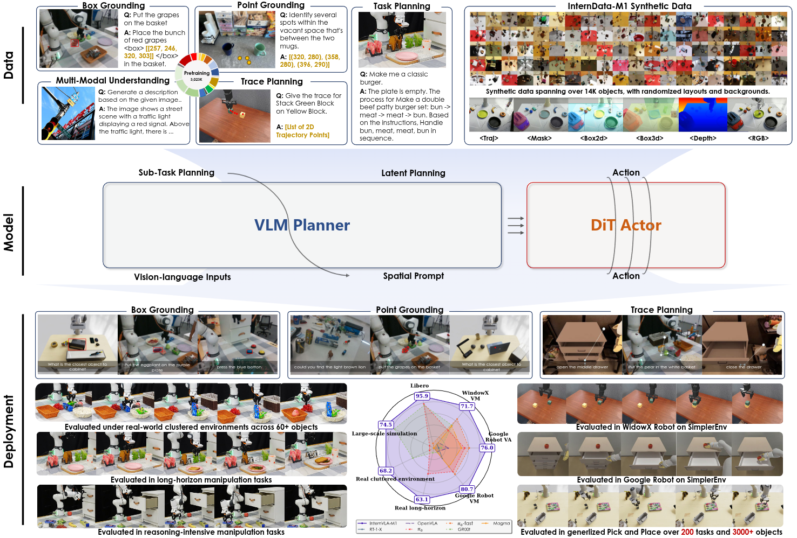

# InternVLA-M1

**InternVLA-M1** is an open-source, end-to-end **vision–language–action (VLA) framework** for building and researching generalist robot policies.

https://github.com/user-attachments/assets/e83ae046-a503-46a8-95e4-ef381919b7f8

[](https://github.com/InternRobotics/InternVLA-M1/blob/InternVLA-M1/assets/InternVLA_M1.pdf) [](https://internrobotics.github.io/internvla-m1.github.io) [](https://youtu.be/n129VDqJCk4) [](LICENSE)



## 🔥 Key Features

1. **Modular & Extensible**  
   All core components (model architecture, training data, training strategies, evaluation pipeline) are fully decoupled, enabling independent development, debugging, and extension of each module.


2. **Dual-System and Dual-Supervision**
   InternVLA-M1 integrates both a language head and an action head under a unified framework, enabling collaborative training with dual supervision. 

3. **Efficient Training & Fast Convergence**
   Learns spatial and visual priors from large-scale multimodal pretraining and transfers them via spatial prompt fine-tuning. Achieves strong performance (e.g., SOTA-level convergence on  in \~2.5 epochs without separate action pretraining). 

## 🎯 Target Audience

1. Users who want to leverage open-source VLMs (e.g., Qwen2.5-VL) for robot control.
2. Teams co-training action datasets jointly with multimodal (vision–language) data.
3. Researchers exploring alternative VLA architectures and training strategies.

## 📊 Experimental Results
|             | WindowX | Google Robot(VA) | Google Robot(VM) | LIBERO |
|-------------|---------|------------------|------------------|--------|
| $\pi_0$         | 27.1    | 54.8             | 58.8             | 94.2   |
| GR00t       | 61.9    | 44.5             | 35.2             | 93.9   |
| InternVLA-M1 |**71.7** |**76.0**          |**80.7**          |**95.9**|


# 🚀 Quick Start

## 🛠 Environment Setup

```bash
# Clone the repo
git clone https://github.com/InternRobotics/InternVLA-M1

# Create conda environment
conda create -n internvla-m1 python=3.10 -y
conda activate internvla-m1

# Install requirements
pip install -r requirements.txt

# Install FlashAttention2
pip install flash-attn --no-build-isolation

# Install InternVLA-M1
pip install -e .
```

## 📘 Examples

We provide several end-to-end examples for reference:

* **Reproduce InternVLA-M1 in simplerEnv**
  [Example](/examples/simplerEnv/setup.md)

* **Training/Deployment on real robots**
  [Example](/examples/real_robot/setup.md)

* **Extending InternVLA-M1**
  [Example](examples/extending_m1/README.md)

## 📈 Model Zoo
We will release a series of pretrained models and checkpoints to facilitate reproduction and downstream use.

- Full list and download links: assets/MODEL_ZOO.md

⚠️⚠️⚠️ **Note on Hugging Face availability**  
Due to Hugging Face Hub storage restrictions, some model weights are not yet uploaded there.  
This is a temporary limitation and not related to the training or upload scripts. We are in contact with Hugging Face to unlock more storage.  

Status: rolling release. If you need early access or encounter broken links, please open an issue.

# 🗺️ Roadmap

* [ ] Release model weights (Stay tuned, coming soon)
* [ ] Add multi-task mixed training examples
* [ ] Release real-robot demo
* [ ] Unify evaluation scripts and metrics

# 🤝 Contributing

We welcome contributions via Pull Requests or Issues.
Please include detailed logs and reproduction steps when reporting bugs.

# 📜 Citation

If you find this useful in your research, please consider citing:

```bibtex
@misc{internvla2024,
  title  = {InternVLA-M1: Latent Spatial Grounding for Instruction-Following Robotic Manipulation},
  author = {InternVLA-M1 Contributors},
  year   = {2025},
  booktitle={arXiv},
}
```

# 📬 Contact

* Issues: Submit via GitHub Issues with detailed logs and steps

# 🙏 Acknowledgements

We thank the open-source community for their inspiring work. This project builds upon and is inspired by the following projects (alphabetical order):
- [IPEC-COMMUNITY](https://huggingface.co/IPEC-COMMUNITY): Curated OXE / LIBERO style multi-task datasets and formatting examples.
- [Isaac-GR00T](https://github.com/NVIDIA/Isaac-GR00T): Standardized action data loader (GR00T-LeRobot).
- [Qwen2.5-VL](https://github.com/QwenLM/Qwen2.5-VL/blob/main/qwen-vl-finetune/README.md): Multimodal input/output format, data loader, and pretrained VLM backbone.
- [CogACT](https://github.com/microsoft/CogACT/tree/main/action_model): Reference for a DiT-style action head design.
- [llavavla](https://github.com/JinhuiYE/llavavla): Baseline code structure and engineering design references.
- [GenManip Simulation Platform](https://github.com/InternRobotics/GenManip): Simulation platform for generalizable pick-and-place based on Isaac Sim.


Notes:
- If any required attribution or license header is missing, please open an issue and we will correct it promptly.
- All third-party resources remain under their original licenses; users should comply with respective terms.


---

Thanks for using **InternVLA-M1**! 🌟
If you find it useful, please consider giving us a ⭐ on GitHub.
